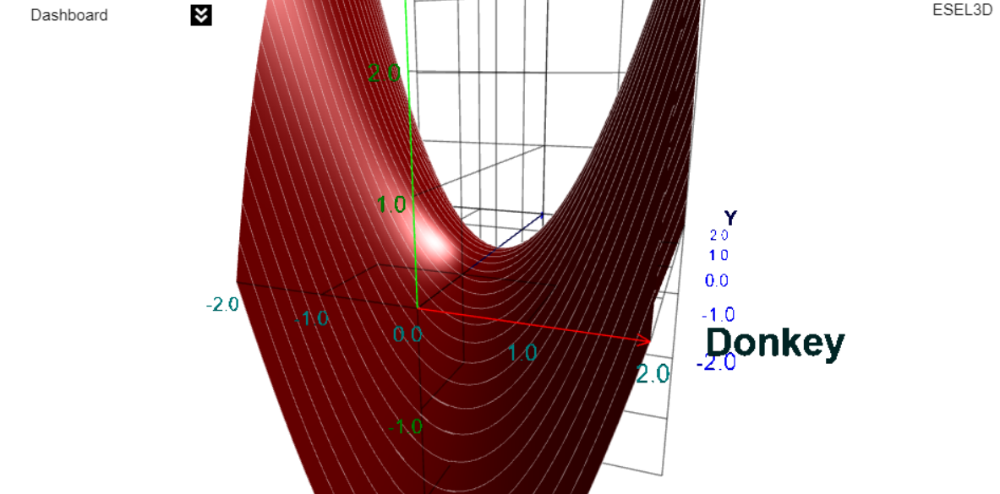
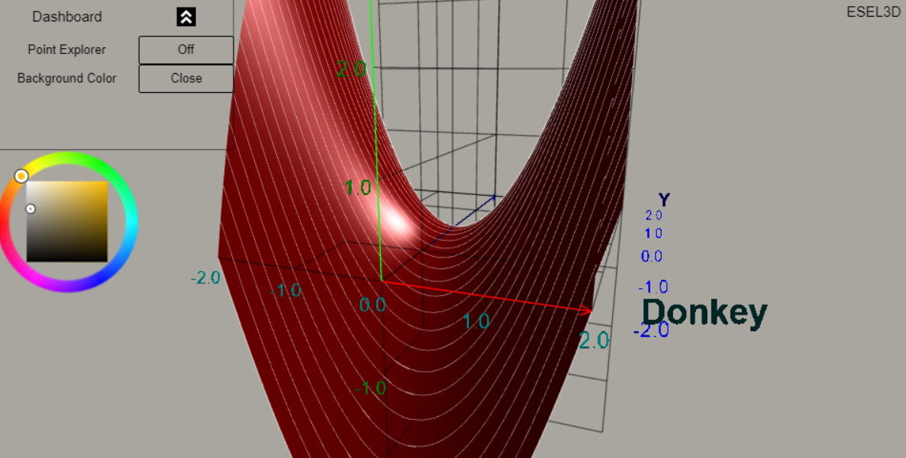
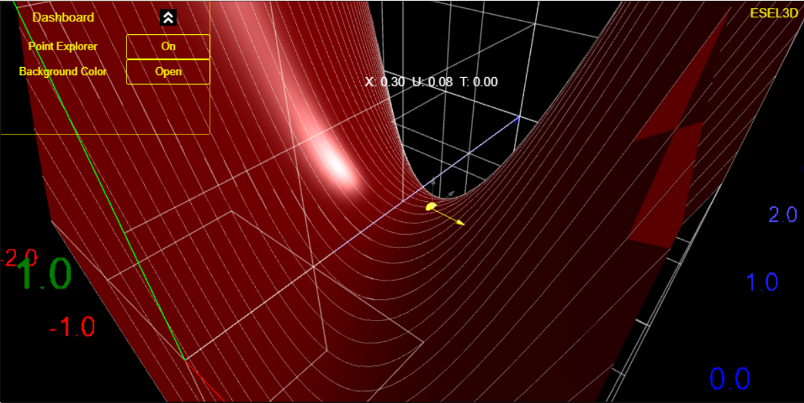

# esel3d

Esel3D is an interactive playground to visualize math in three spatial dimensions.
It is a 3D plotter for curves, surfaces, shapes and more. The redering uses [BabylonJS](https://www.babylonjs.com/) 
game engine to produce vibrant visuals and provides intuitive controls right inside a
Jupyter or Google Colab cell. 

## Navigate

Explore and view the plot from all angles in 3D space.
 

 
## Configurable

Add custom labels. Change the color scheme of the axis. Chose the background color which is the most appealing. 
 

 

## Inspect

With the point explorer gizmo, the user can retrieve point location. 
 

 
 

